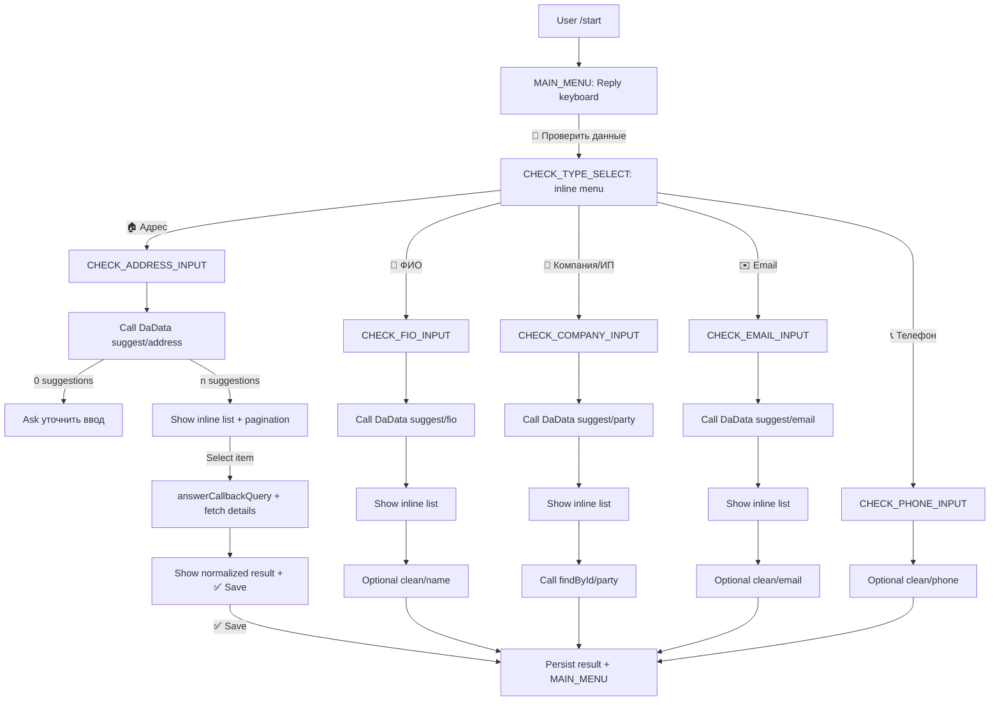
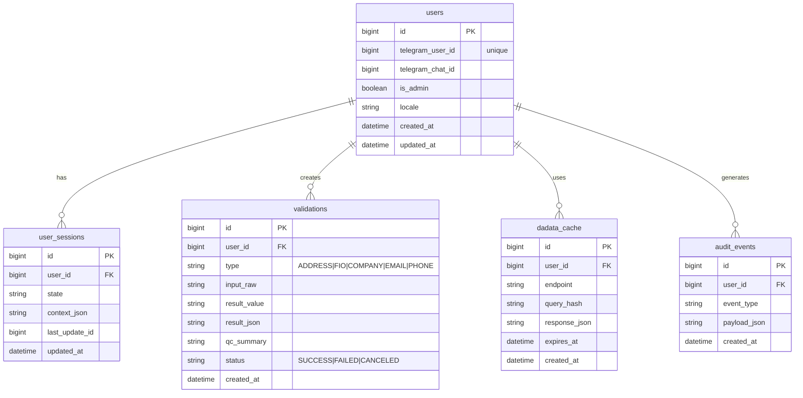

# Техническое задание для Telegram-бота с DaData Max и деплоем на Render

Это ТЗ можно отдавать в разработку: оно описывает цели, бизнес-правила, команды и сценарии, детальную логику кнопок и состояний, интеграцию с DaData (включая ограничения Max), деплой на Render, тестирование, логи/метрики, а также план работ и оценку стоимости.

## Executive summary

Бот в Telegram должен помогать пользователям быстро и без ошибок вводить и проверять данные (адреса, ФИО, реквизиты компаний/ИП по ИНН/ОГРН, email, телефон) через подсказки и стандартизацию DaData, при этом работать в модели «человек выбирает вариант» (а не «бот автоматически угадывает»). Это принципиально: подсказки DaData не предназначены для полностью автоматической обработки — они предлагают варианты, а финальное решение должен принять человек.

Ключевая архитектура: webhook от Telegram → Web Service на Render (HTTPS) → обработка Update и состояний пользователя → обращения к DaData → ответы в Telegram (сообщения + inline/reply клавиатуры) → запись результатов и аудита в БД. Telegram при webhook доставке повторяет запросы при неуспешной обработке (ответ не 2xx), поэтому обработчик должен быть идемпотентным и быстро возвращать 2xx.

Тариф DaData Max задаёт дневной лимит запросов «от 200 000» и включает ряд «расширенных» данных (например, аффилированные компании) только на Max; при этом стандартизация/проверки (Clean API) не входят ни в один тариф и оплачиваются отдельно за запись.

## Контекст и допущения

Входные параметры в запросе не фиксируют язык реализации, базу данных и способ аутентификации пользователей; ниже — рабочие допущения и варианты.

### Допущения, которые влияют на реализацию

Язык реализации: **не задан**. Допущение для примеров в ТЗ (Dockerfile, структура проекта, тесты): Python + HTTP-фреймворк под webhook (например, FastAPI) и любая удобная библиотека/обёртка для Bot API. Это допущение можно заменить на Node.js (требования к API и инфраструктуре сохраняются).

База данных: **не задана**. Допущение: PostgreSQL (как управляемая БД или внешний managed), потому что нужен надёжный storage для состояний, идемпотентности и аудита. Альтернатива: SQLite (только с persistent disk, и с ограничениями по конкурентности) — для прототипа.

Аутентификация пользователей: **не задана**. Допущение: «аутентификация» = Telegram `user_id` + опциональный whitelist/роль админа. Telegram в Update всегда передаёт уникальный идентификатор пользователя; бот строит контекст по нему.

### Границы ответственности и «что вне скоупа» по умолчанию

Подсказки DaData не гарантируют «правильный ответ» и не подходят для автоматической обработки без участия человека — бот обязан подводить пользователя к выбору варианта (inline-кнопки) и/или подтверждению.

Функции, которые у DaData оплачиваются отдельно (и не входят в подписку), по умолчанию должны быть **фича-флагом**: включаются явно и сопровождаются предупреждением о стоимости. В частности, стандартизация адресов/ФИО, проверка email/телефона и т.п.

## Цели и бизнес-требования

### Цели

Сократить долю «грязных» данных (опечатки, неполный адрес, неверный ИНН, мусорный email) за счёт подсказок и стандартизации DaData, применяемых в управляемом диалоге Telegram.

Ускорить ввод данных: пользователь делает 1–2 сообщения + 1 клик по подсказке, вместо ручного переписывания реквизитов/адресов.

Сделать процесс проверяемым: хранить историю проверок, кто/когда/что вводил, что выбрал, какие коды качества (qc) получены.

### Бизнес-требования

Доступность: бот должен быть доступен 24/7; инфраструктура должна поддерживать health checks и автоматический рестарт при деградации.

Контроль стоимости DaData: подписочные запросы ограничены дневным лимитом, а pay-per-use списываются отдельно; при исчерпании лимита подписки сервисы по подписке отключаются до следующего дня.

Соблюдение ограничений API: у DaData есть ограничения по частоте и новым соединениям; у Telegram — ограничения на payload кнопок и требования к обработке callback.

## Функциональные требования

### Роли и доступы

Пользователь:
- Запускает бота, выбирает тип проверки, вводит данные, выбирает подсказки, получает нормализованный результат, сохраняет/экспортирует.

Администратор (опционально):
- Управляет whitelist пользователей.
- Включает/выключает платные методы (Clean API).
- Смотрит агрегированную статистику, ошибки DaData/Telegram, нагрузку.

### Команды и навигация

Поведение команд должно быть единообразным: команда всегда прерывает текущий сценарий (с безопасным сохранением черновика) и переводит в понятное состояние.

Таблица команд и назначений:

| Команда | Назначение | Доступ | Эффект на состояние |
|---|---|---|---|
| `/start` | Онбординг + главное меню | все | RESET → `MAIN_MENU` |
| `/help` | Справка по возможностям и ограничениям | все | остаётся в текущем |
| `/check` | Начать новую проверку | все | `MAIN_MENU` → `CHECK_TYPE_SELECT` |
| `/history` | История последних проверок | все | `MAIN_MENU` → `HISTORY` |
| `/settings` | Настройки пользователя | все | `MAIN_MENU` → `SETTINGS` |
| `/admin` | Админ-панель (в чат-формате) | админ | `ADMIN_MENU` |

Требование Telegram: список команд можно устанавливать на стороне Bot API (`setMyCommands`), чтобы они отображались в UI клиента.

### Главная Reply-клавиатура

Reply-клавиатура фиксированная (минимум кнопок, чтобы не «захламлять» чат), показывается в `MAIN_MENU` и `CHECK_*` сценариях:

- **🔎 Проверить данные** (переход в выбор типа проверки)
- **📜 История**
- **⚙️ Настройки**
- **❓ Помощь**

Для закрытия пользовательской клавиатуры использовать `ReplyKeyboardRemove` в момент, когда сценарий требует точного ввода (чтобы не мешала).

### Типы проверок (обязательный функционал)

Бот поддерживает проверки:

- Адрес (подсказки + выбор + опциональная стандартизация/гео-коды)
- ФИО (подсказки + выбор + опциональная стандартизация/склонение)
- Компания/ИП (по ИНН/ОГРН или названию; подсказки + расширенные сведения по ИНН/ОГРН)
- Email (подсказки домена/локальной части + опциональная стандартизация/коды качества)
- Телефон (стандартизация/оператор/регион — опционально, т.к. платно)

Эндпоинты и ограничения приведены в разделах интеграции; ключевое правило UX: подсказки → выбор пользователем → подтверждение.

### Сценарии диалога и состояния пользователя

#### Состояния (state machine)

Минимальный набор состояний:

- `MAIN_MENU`
- `CHECK_TYPE_SELECT`
- `CHECK_ADDRESS_INPUT`
- `CHECK_ADDRESS_SUGGESTIONS`
- `CHECK_ADDRESS_CONFIRM`
- `CHECK_FIO_INPUT`
- `CHECK_FIO_SUGGESTIONS`
- `CHECK_FIO_CONFIRM`
- `CHECK_COMPANY_INPUT`
- `CHECK_COMPANY_SUGGESTIONS`
- `CHECK_COMPANY_CONFIRM`
- `CHECK_EMAIL_INPUT`
- `CHECK_EMAIL_SUGGESTIONS`
- `CHECK_EMAIL_CONFIRM`
- `CHECK_PHONE_INPUT`
- `CHECK_PHONE_CONFIRM`
- `HISTORY`
- `SETTINGS`
- `ADMIN_MENU` (опционально)

Требование к идемпотентности: хранить `last_update_id` (или набор обработанных `update_id`) на пользователя/чат, чтобы не повторять действия при повторной доставке webhook.

#### Inline-кнопки: общий принцип

Inline-кнопки используются для:
- выбора одной из подсказок,
- пагинации подсказок,
- подтверждения «сохранить результат»,
- отмены сценария.

Ограничение Telegram: `callback_data` у inline-кнопки 1–64 байта. Поэтому callback должен нести короткий ключ/маркер, а «тяжёлые» данные (полный ответ DaData) — храниться в БД/кеше.

Telegram UX-обязательство: после нажатия inline-кнопки клиент показывает progress bar, пока бот не вызовет `answerCallbackQuery`. Даже если не нужно уведомление — отвечать нужно всегда.

### Проверка адреса: диалог, кнопки, валидация

#### Ввод и подсказки

Шаг: пользователь выбирает «Адрес» → бот просит «Введите адрес одной строкой (город, улица, дом; можно с квартирой)» и переводит в `CHECK_ADDRESS_INPUT`.

Эффект: пользователь присылает текст, бот вызывает `suggest/address` и показывает список подсказок.

DaData `suggest/address` умеет искать по любой части адреса, исправлять опечатки/раскладку, возвращать адрес по кадастровому номеру и ФИАС-коду, поддерживает разные страны (детализация зависит от страны).

Ограничение: длина `query` ≤ 300 символов; лимиты по частоте — 30 запросов/сек с одного IP и 60 новых соединений/мин с одного IP.

Inline UI:
- Сообщение: «Нашёл варианты — выберите или уточните ввод».
- Inline-кнопки 1..5: первые 5 подсказок (`value` или укороченный формат).
- Если подсказок больше 5: ряд кнопок `⬅️` и `➡️` для пагинации, плюс `✏️ Уточнить` и `❌ Отмена`.

#### Логика «пользователь выбрал конкретный адрес»

После выбора варианта бот делает один из двух путей:

Путь A (рекомендуемый под подсказки): повторный запрос `suggest/address` с `count=1`, при этом `query` = выбранный `unrestricted_value` из предыдущего ответа.

Путь B (точное восстановление по идентификатору): если в подсказке есть `fias_id`/`kladr_id`/`cadnum`, бот вызывает `findById/address` и получает детальную карточку. Рекомендуется хранить адрес строкой дополнительно, потому что ФИАС-коды домов/квартир могут меняться, а поиск идёт по актуальным кодам.

#### Опциональная стандартизация адреса (платно)

Если включён фича-флаг `ENABLE_CLEAN_ADDRESS=true`, бот дополнительно вызывает `clean/address` и:
- возвращает разбор по полям, индексы, координаты, коды ФИАС/КЛАДР/ОКАТО/ОКТМО, qc-коды (метод только для России);
- отображает пользователю коды качества (например, `qc`, `qc_geo`) и предупреждает, если код «на проверку».

Ограничения `clean/address`: в запросе разрешён только один адрес; частота 20 запросов/сек; 60 новых соединений/мин; метод нельзя вызывать из браузерного JS из-за риска кражи секретного ключа — значит вызывать только сервер‑сервер.

#### Сообщение результата и подтверждение

Формат результата (пример требований к контенту):
- «Адрес: … (полный)»
- «Индекс: …»
- «ФИАС (ГАР) id: …»
- «КЛАДР: …»
- «Координаты: … (`qc_geo=…`)»
- «Сохранить результат?»

Inline-кнопки:
- `✅ Сохранить`
- `📋 Скопировать` (альтернатива: отправить отдельным сообщением без клавиатуры)
- `🔁 Проверить другой адрес`

### Проверка ФИО: диалог и валидация

Подсказки ФИО (`suggest/fio`) исправляют раскладку, определяют пол, могут подсказывать как одной строкой, так и по частям; при этом подсказки не предназначены для автоматической обработки/транслитерации/склонения, и для этого предлагается использовать стандартизацию.

Ограничения `suggest/fio`: `query` ≤ 300; дневной лимит по тарифу; 30 запросов/сек; 60 новых соединений/мин.

Параметры: `count` по умолчанию 10, максимум 20; `gender` (`UNKNOWN/MALE/FEMALE`) и `parts` для гранулярных подсказок.

Опциональная стандартизация ФИО (`clean/name`, платно): исправляет опечатки и транслитерирует, определяет пол и склоняет по падежам (`result_genitive` и т.д.).

Ограничения `clean/name`: только одно ФИО в запросе; 20 запросов/сек; 60 новых соединений/мин; нельзя вызывать из браузерного JS.

### Проверка компании/ИП (ИНН/ОГРН/название)

#### Подсказки организаций

`suggest/party` ищет компании и ИП по ИНН/ИНН-КПП/ОГРН, названию, ФИО (для ИП), ФИО руководителя и адресу до улицы; может искать по комбинации ИНН+название+адрес и находить филиалы при указании КПП.

Ограничения: `query` ≤ 300; 30 запросов/сек; 60 новых соединений/мин; а также ограничения по числу условий в `locations/locations_boost` ≤ 10.

Важно для UX: для ~25% компаний налоговая служба не сообщает КПП филиалов — такие филиалы через КПП не найти; рекомендуемый обходной путь — поиск по ИНН+город+улица.

#### Расширенные сведения «всё о компании» по ИНН/ОГРН

Для подтверждения и обогащения использовать метод `findById/party` (в документации — «организация по ИНН или ОГРН»): возвращает «все доступные сведения», в отличие от `suggest`, который возвращает базовые поля.

Параметры: `query` (ИНН/ИНН-КПП/ОГРН), `count` (по умолчанию 10, максимум 300), `branch_type` (`MAIN/BRANCH`), `kpp`, `type` (`LEGAL/INDIVIDUAL`), фильтры по статусу.

#### Особенности тарифа Max

На тарифе Max отдельно отмечается доступность сервиса «Аффилированные компании» только на «Максимальном», а также расширенный доступ к приватным справочникам.

### Проверка email

`suggest/email` подсказывает локальную часть и домен, исправляет опечатки домена, но не предназначен для автоматической проверки и не умеет классифицировать адреса; для автоматической обработки предлагается стандартизация.

Ограничения `suggest/email`: `query` ≤ 300; 30 запросов/сек; 60 новых соединений/мин; дневной лимит по тарифу.

Опциональная стандартизация email (`clean/email`, платно): исправляет опечатки, классифицирует тип (`PERSONAL/CORPORATE/ROLE/DISPOSABLE`) и возвращает `qc`-код; при `qc=0` «реальное существование адреса не проверяется» — это обязательная пометка в интерфейсе.

Ограничения `clean/email`: только один email в запросе; 20 запросов/сек; 60 новых соединений/мин; нельзя вызывать из браузерного JS (секретный ключ).

### Проверка телефона (опционально)

Функция стандартизации телефона (`clean/phone`, платно) проверяет телефон, восстанавливает код города/DEF, оператора, регион и часовой пояс с учётом переносов номера между операторами.

Требование UX: пользователь должен видеть, что это платная операция (20 коп. за проверку телефона) и она идёт «вне подписки».

### История и экспорт результатов

История (`/history`):
- Последние N проверок (минимум 20) с типом проверки, исходным вводом, выбранным значением, временем, статусом и (если применимо) qc-кодами.

Экспорт:
- `📄 Экспорт JSON` (бот отправляет файл/сообщение с JSON)
- `📄 Экспорт CSV` (если нужен бизнес-процесс)

Риски: лимиты Bot API по отправке файлов; при необходимости ограничить размер экспорта и/или отправлять частями.

### Примеры сообщений и UI (обязательный стиль)

Онбординг (`/start`):
- Текст: «Я проверяю и нормализую адреса, ФИО, компании/ИП, email и телефоны. Выберите действие.»
- Reply-кнопки: `🔎 Проверить данные | 📜 История | ⚙️ Настройки | ❓ Помощь`

Выбор типа:
- Inline-кнопки (в 2 ряда):
  - `🏠 Адрес`
  - `👤 ФИО`
  - `🏢 Компания/ИП`
  - `✉️ Email`
  - `📞 Телефон`

Пример списка адресных подсказок:
- Сообщение:
  - «Варианты:»
  - «1) 127642, г Москва, ул Сухонская, д 11»
  - «2) …»
- Inline-кнопки:
  - `1` `2` `3` `4` `5`
  - `⬅️` `➡️`
  - `✏️ Уточнить` `❌ Отмена`

## Нефункциональные требования

### Безопасность

Webhook security: при установке webhook использовать `secret_token`, и на стороне сервиса проверять заголовок `X-Telegram-Bot-Api-Secret-Token` на совпадение.

Секреты:
- Токен бота, API Key DaData, Secret Key DaData хранить только как переменные окружения/secret files на Render, не в репозитории.
- Clean API нельзя вызывать из browser JS, потому что можно украсть Secret Key; поэтому все вызовы — строго серверные.

Анти-абьюз:
- Rate limit на пользователя (например, 30 запросов/мин на подсказки, 10/мин на платные clean-операции).
- Блокировка при подозрении на скриптовую активность (много одинаковых запросов, высокая частота).

Логи и ПДн:
- В продуктиве маскировать или хэшировать чувствительные поля в логах (полные ФИО/адреса/email/телефон) — хранить в БД, но в логи писать сокращённо.

### Масштабируемость и надежность

Webhook vs polling:
- В webhook-режиме Telegram отправляет HTTPS POST с Update на ваш URL и повторяет доставку при ответе не 2xx. Это требует быстрого ответа и идемпотентности.

Render runtime:
- Сервис должен поднимать HTTP-сервер и слушать `0.0.0.0` на порту `PORT` (по умолчанию 10000). Это обязательное требование Render для web services.

Graceful shutdown:
- При деплоях/обслуживании Render отправляет `SIGTERM`, поэтому приложение должно корректно завершать работу: перестать принимать новые запросы, дождаться текущих, закрыть соединения с БД.

Health checks:
- Реализовать endpoint `/healthz`, который всегда возвращает 2xx при нормальной работе.

SLA (внутренний, задаётся в ТЗ):
- Uptime бота: 99.5%/мес.
- P95 время ответа пользователю (от Update до sendMessage): ≤ 2.5 сек для подсказок; ≤ 4 сек для сценариев с clean/findById.
- Восстановление после инцидента: ≤ 30 минут (при наличии алёртов и доступа к логам/метрикам).

## Интеграция с DaData

### Аутентификация и форматы

Подсказки (Suggestions API):
- HTTP POST на `https://suggestions.dadata.ru/suggestions/api/4_1/rs/suggest/<type>`
- Заголовки: `Content-Type: application/json`, `Accept: application/json`, `Authorization: Token <API_KEY>`

Стандартизация (Clean API, платно):
- HTTP POST на `https://cleaner.dadata.ru/api/v1/clean/<type>`
- Заголовки: `Content-Type: application/json`, `Accept: application/json` (где применимо), `Authorization: Token <API_KEY>`, `X-Secret: <SECRET_KEY>`

Кодировка: UTF‑8 (жёстко фиксировать в клиенте).

### Таблица эндпоинтов DaData и что с ними делать

| Тип данных | Подсказки (в подписке) | findById/расширение (в подписке) | Стандартизация/проверка (платно) | Ключевые ограничения |
|---|---|---|---|---|
| Адрес | `/suggest/address` | `/findById/address` | `/clean/address` | suggest: 30 rps/IP, 60 conn/min, query≤300; clean: 20 rps/IP, 1 адрес/запрос |
| ФИО | `/suggest/fio` | — | `/clean/name` | suggest: query≤300, 30 rps/IP; clean: 1 ФИО/запрос, 20 rps/IP |
| Компания/ИП | `/suggest/party` | `/findById/party` | (отдельные сервисы вне подписки) | suggest: locations≤10, query≤300; филиалы: КПП может отсутствовать |
| Email | `/suggest/email` | — | `/clean/email` | suggest: query≤300, 30 rps/IP; clean: 1 email/запрос, 20 rps/IP, «существование не проверяется» |
| Телефон | — | — | `/clean/phone` | Платно; ограничения по частоте учитывать как для clean-сервисов |

### Ошибки и обработка отказов

#### Suggestions API: коды ответа и реакция

Для `suggest/*` использовать обработку кодов:
- 400 (битый JSON), 401 (нет API-key), 403 (неверный API-key / не подтверждена почта / исчерпан дневной лимит подписки), 405 (не POST), 413 (слишком большой запрос/условий), 429 (слишком много запросов/соединений), 5xx (внутренняя ошибка).

Реакция бота:
- 400/405/413: «Запрос слишком сложный/длинный. Упростите ввод.»
- 401/403: «Проблема с доступом к сервису проверки (ключ/лимит).» + событие в алёрты/логи.
- 429/5xx: retry с экспоненциальной задержкой и jitter (например 0.2s → 0.5s → 1s, максимум 3 попытки), затем «Сервис временно занят, попробуйте позже».

#### Clean API: коды ответа и реакция

Для `clean/*`:
- 401 (включая отсутствие API‑ключа или secret key), 403 (не подтверждена почта или недостаточно средств), 429 и 5xx.

Реакция бота:
- 403 по недостатку средств: «Проверка (платная) недоступна: пополните баланс стандартизации.» + метрика/алёрт.

### Оптимизация запросов и расход лимита Max

Любое обращение к DaData = 1 запрос. В Telegram «посимвольная» модель подсказок не воспроизводится 1-в-1, но риск перерасхода остаётся из‑за итераций «уточните ввод». Поэтому:

- Кешировать результаты `suggest/*` на короткое TTL (например 5 минут) по ключу (`type`, `normalized_query`, `locations filters`) на пользователя.
- Использовать один HTTP-клиент с keep-alive и пулом соединений, чтобы не упираться в лимит новых соединений 60/мин на IP.
- Ограничивать `count` (например 5–10), потому что Telegram всё равно покажет мало вариантов.

Если лимит подписки исчерпан, подписочные сервисы отключаются до 00:00 следующего дня; платные «вне подписки» продолжают работать с тарификацией за каждый запрос.

### Примеры HTTP-запросов к DaData (как должно выглядеть)

Пример: подсказки адреса
```bash
curl -X POST \
  -H "Content-Type: application/json" \
  -H "Accept: application/json" \
  -H "Authorization: Token ${DADATA_API_KEY}" \
  -d '{ "query": "москва сухонская 11" , "count": 5 }' \
  https://suggestions.dadata.ru/suggestions/api/4_1/rs/suggest/address
```

Пример: «пользователь выбрал конкретный адрес» (`count=1`, `query=unrestricted_value`)
```bash
curl -X POST \
  -H "Content-Type: application/json" \
  -H "Accept: application/json" \
  -H "Authorization: Token ${DADATA_API_KEY}" \
  -d '{ "query": "127642, г Москва, ул Сухонская, д 11", "count": 1 }' \
  https://suggestions.dadata.ru/suggestions/api/4_1/rs/suggest/address
```

Пример: стандартизация адреса (платно, требуется `X-Secret`)
```bash
curl -X POST \
  -H "Content-Type: application/json" \
  -H "Accept: application/json" \
  -H "Authorization: Token ${DADATA_API_KEY}" \
  -H "X-Secret: ${DADATA_SECRET_KEY}" \
  -d '[ "мск сухонска 11/-89" ]' \
  https://cleaner.dadata.ru/api/v1/clean/address
```

## Деплой на Render

### Архитектура окружения на Render

Минимальный набор ресурсов:
- Web Service (runtime: Docker)
- База данных (PostgreSQL) или внешний managed DB
- (Опционально) отдельный background worker для тяжёлых задач (экспорт, батчи), если появятся требования.

Render web service:
- получает уникальный `onrender.com` домен и доступен с публичного интернета;
- должен слушать `0.0.0.0` и порт `PORT` (по умолчанию 10000).

### Структура репозитория

Рекомендуемая структура (язык-агностично, но с ориентацией на контейнеризацию):

```text
/app
  /src
    main.py                # входная точка HTTP (webhook)
    bot/
      handlers.py          # роутинг команд/событий
      keyboards.py         # генерация inline/reply клавиатур
      state_machine.py     # состояния и переходы
    integrations/
      dadata_client.py     # клиент DaData + ретраи + лимиты
    storage/
      models.py            # модели БД
      repo.py              # репозитории/DAO
  /tests
    test_states.py
    test_dadata.py
    test_webhook.py
  requirements.txt
  Dockerfile
  .dockerignore
  README.md
```

### Переменные окружения (обязательные)

Секреты и конфигурация должны задаваться через Render env vars / secret files, а не коммититься в код.

Обязательные:
- `TELEGRAM_BOT_TOKEN`
- `TELEGRAM_WEBHOOK_SECRET` (для `secret_token` в `setWebhook` и проверки заголовка)
- `DADATA_API_KEY`
- `DADATA_SECRET_KEY` (только если включены платные clean-методы)
- `DATABASE_URL`
- `ENABLE_CLEAN_ADDRESS` / `ENABLE_CLEAN_NAME` / `ENABLE_CLEAN_EMAIL` / `ENABLE_CLEAN_PHONE`
- `LOG_LEVEL` (`INFO/WARN/ERROR`)
- `PORT` (обычно не задавать вручную; Render даёт по умолчанию 10000)

### Настройка автодеплоя

Render поддерживает автодеплой при изменениях в привязанной ветке репозитория: при push/merge в ветку по умолчанию происходит rebuild + redeploy.

Критичное правило: деплой web service на Render — без downtime, **кроме случая** использования persistent disk (тогда возможны ограничения).

### Health check, мониторинг и логирование на Render

Health check endpoint:
- `/healthz` возвращает 200, если:
  - БД доступна (опционально; можно разделить на `/healthz` и `/readyz`)
  - очередь задач (если есть) не в аварии
  - DaData не проверяем синхронно (иначе рискуем ложными инцидентами), но агрегируем ошибки DaData в метриках.

Логи:
- доступны в Render Dashboard, с поиском и фильтрами;
- при необходимости — streaming logs в сторонний syslog‑совместимый провайдер.

Метрики:
- CPU/memory, HTTP requests, latency percentiles, bandwidth и др.;
- при необходимости — stream через OpenTelemetry во внешний провайдер.

### Пример Dockerfile

Пример ориентирован на Python web service с HTTP-сервером, который читает `PORT` и слушает `0.0.0.0`.

```dockerfile
FROM python:3.12-slim

ENV PYTHONDONTWRITEBYTECODE=1
ENV PYTHONUNBUFFERED=1

WORKDIR /app

COPY requirements.txt .
RUN pip install --no-cache-dir -r requirements.txt

COPY ./src ./src

EXPOSE 10000

CMD ["python", "-m", "src.main"]
```

## Тестирование, логи, метрики, стоимость и план работ

### Тестирование

#### Набор тестов (минимум)

Unit:
- State machine: переходы между состояниями, отмена сценария, обработка «неожиданного» ввода.
- Генерация клавиатур: корректные `callback_data`, пагинация, скрытие/показ reply клавиатуры.
- DaData client: ретраи на 429/5xx, отсутствие ретраев на 4xx, таймауты, лимиты частоты.

Integration:
- Webhook handler: при повторной доставке одного и того же Update не выполняет действия второй раз (идемпотентность по `update_id`).
- Контракт DaData: мок/записанные ответы (VCR-подход). Проверять парсинг полей, отсутствие падений на `null`.

E2E (смоук):
- `/start` → «Адрес» → подсказки → выбор → сохранить → `/history`.

#### Тестовые данные

Адреса:
- валидный полный: «Москва, Сухонская улица, 11 кв 89»
- с опечатками/раскладкой: «vjcrdf ce[jycrfz 11».

ФИО:
- «Срегей владимерович иванов» (ожидается исправление и склонения при `clean/name`).

Компания:
- ИНН тестовый формат: 10/12 цифр; кейсы ИП и юрлица; кейс ИНН/КПП через слеш.

Email:
- «serega@yandex/ru» (ожидается исправление домена и `qc=4` как «исправлены опечатки»).

### Требования к логам и метрикам

Логи (структурированные JSON):
- `timestamp`
- `level`
- `request_id`
- `telegram_update_id`, `telegram_user_id`, `chat_id`
- `flow` (`ADDRESS/FIO/COMPANY/EMAIL/PHONE`)
- `state_before`, `state_after`
- `dadata_endpoint` (если был вызов)
- `dadata_http_status`, `dadata_latency_ms`, `dadata_error_code` (если применимо)
- `result_status` (`SUCCESS/NO_SUGGESTIONS/VALIDATION_FAILED/SERVICE_ERROR`)

Метрики приложения:
- `bot_updates_total{type=...}`
- `bot_processing_latency_ms_bucket`
- `dadata_requests_total{endpoint,status}`
- `dadata_rate_limited_total`
- `state_transitions_total{from,to}`

### Оценка стоимости

DaData:
- Тариф «Максимальный»: **56 000 ₽ в год**, «от 200 000 запросов в день».
- Стандартизация адресов/ФИО и проверки email/телефона не входят ни в один тариф и оплачиваются отдельно (например, 20 копеек за запись).
- Если исчерпан дневной лимит подписки, подписные сервисы отключаются до следующего дня; платные «вне подписки» продолжают списывать деньги за каждый запрос.

Render:
- Стоимость зависит от выбранного плана рабочей области и compute; к стоимости плана добавляются compute costs.
- Для эксплуатационного уровня (latency percentiles, request logs и т.п.) могут потребоваться более высокие планы/фичи.

### Примерный план работ и оценки времени

| Этап | Содержание | Оценка | Риски | Альтернатива/ускорение |
|---|---|---:|---|---|
| Аналитика и финализация ТЗ | уточнение ролей, платных фич, форматов истории/экспорта | 2–3 | неясный скоуп «платных» проверок | зафиксировать MVP: только подсказки |
| Архитектура и модели данных | state machine, ER-модель, идемпотентность, стратегия кеша | 2–3 | неправильная гранулярность состояний → сложный UX | быстрее: меньше состояний, больше «мастер-меню» |
| Интеграция с DaData (MVP) | suggest/address, suggest/fio, suggest/party, suggest/email + UI выбора | 4–6 | лимиты 429/новые соединения | пул соединений + кеш |
| Расширение DaData (по флагам) | findById/address/party, clean/address/name/email/phone | 3–5 | платные ошибки 403 (нет средств) | отключить clean на проде до пополнения |
| Telegram UX и команды | reply/inline клавиатуры, пагинация, answerCallbackQuery | 3–4 | callback_data лимит 64 байта | хранить payload в БД/кеше |
| Инфраструктура Render | Docker, env vars/secrets, health check, автодеплой | 2–3 | порт/хост не поднят → деплой падает | строго следовать PORT/0.0.0.0 |
| Наблюдаемость | логи, метрики, алёрты, дашборды | 2–4 | нет сигналов о деградации DaData | алёрт по % ошибок за период |
| Тесты и приёмка | unit/integration/e2e, тестовые данные, чеклист | 3–5 | «плавающие» ответы внешних API | контрактные тесты с моками |
| Пилот и стабилизация | ограниченный rollout, сбор фидбека, тюнинг лимитов | 3–5 | всплеск нагрузки/лимитов | rate limit + кеш |

### Диаграммы

Flowchart логики кнопок и сценария «проверка данных»


ER-диаграмма хранения данных

